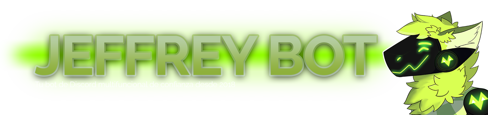

  
  
  
  
  
  

  > Perpetuamente en desarrollo.

# ⭐ Acerca de
Jeffrey Bot es un bot de Discord **multipropósitos** programado por y para el servidor de Discord de [@DevJeffreyG](https://github.com/DevJeffreyG).

Más información próximamente en la página web del bot.

## 🦊 Más de Jeffrey Bot
- ### [Dashboard](https://github.com/DevJeffreyG/JeffreyBotDashboard)
  La página web también es Open Source.
- ### [Cliente](https://github.com/DevJeffreyG/JeffreyBotClient)
  Un Cliente usado para los usos de items en las **Tiendas Externas**.

# 💚 Créditos
- ### [Discord.JS](https://github.com/discordjs/discord.js).
- ### [MongoDB (mongoose)](https://www.mongodb.com) como base de datos.
- ### 💜 [@Jleguim](https://github.com/Jleguim/) en el early-dev.
